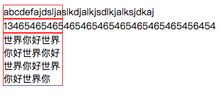
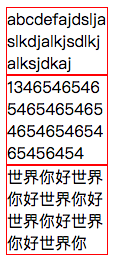

# 强制中英文换行
在开发中经常会遇到，一个容器固定宽度、里面是中文可以正常自动换行，但是英文和数字不会自动换行如：
```
<!DOCTYPE html>
<html lang="en">
<head>
    <meta charset="UTF-8">
    <title>Document</title>
    <style>
        .box{
            width:100px;
            border:1px solid red;
        }
    </style>
</head>
<body>
    <div class="box">abcdefajdsljaslkdjalkjsdlkjalksjdkaj</div>
    <div class="box">13465465465465465465465465465465456454</div>
    <div class="box">世界你好世界你好世界你好世界你好世界你好世界你</div>
</body>
</html>
```
显示效果：  
  
这时候我们只需要添加   
> word-break:break-all;

```
<!DOCTYPE html>
<html lang="en">
<head>
    <meta charset="UTF-8">
    <title>Document</title>
    <style>
        .box{
            width:100px;
            border:1px solid red;
            word-break:break-all;
        }
    </style>
</head>
<body>
    <div class="box">abcdefajdsljaslkdjalkjsdlkjalksjdkaj</div>
    <div class="box">13465465465465465465465465465465456454</div>
    <div class="box">世界你好世界你好世界你好世界你好世界你好世界你</div>
</body>
</html>
```
显示效果：  
  
