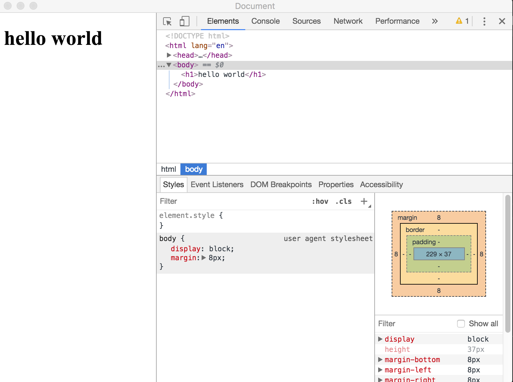

# electron打包
### 1、下载[electron 入门教程demo](https://github.com/13653389794/plain/tree/master/electron/demo/demo01)项目  
### 2、下载electron-packager
```
npm install --save-dev electron-packager
```
### 3、修改package.json
mac
```
{
  "name": "demo01",
  "version": "1.0.0",
  "description": "",
  "main": "main.js",
  "scripts": {
    "start": "electron .",
    "packageDarwin": "electron-packager . 'Hosts' --platform=darwin --arch=x64  --out=./dist --asar --app-version=2.0.1 --ignore=\"(dist|src|docs|.gitignore|LICENSE|README.md|webpack.config*|node_modules)\""
  },
  "author": "",
  "license": "ISC",
  "dependencies": {
    "electron": "^3.0.11"
  }
}
```
### 4、执行打包命令
```
npm run packageDarwin
```
项目根目录下生成dist文件夹
### 5、双击dist/Hosts-darwin-x64/Hosts
如果出现下图说明成功



### 各平台的打包命令
```
os系统: 
    "packageDarwin": "electron-packager . 'Hosts' --platform=darwin --arch=x64 --icon=hosts.icns --out=./dist --asar --app-version=2.0.1 --ignore=\"(dist|src|docs|.gitignore|LICENSE|README.md|webpack.config*|node_modules)\"",

os系统: 
    "packageDarwin": "electron-packager . 'Hosts' --platform=darwin --arch=x64 --icon=hosts.icns --out=./dist --asar --app-version=2.0.1",


windows系统:  
    "packageWin": "electron-packager . 'Hosts' --platform=win32 --arch=x64 --icon=hosts.ico --out=./dist --asar --app-version=2.0.1 --ignore=\"(dist|src|docs|.gitignore|LICENSE|README.md|webpack.config.js|node_modules)\"",

windows系统:  
    "packageWin": "electron-packager . 'Hosts' --platform=win32 --arch=x64 --icon=hosts.ico --out=./dist --asar --app-version=2.0.1",


linux系统:  
    "packageLinux": "electron-packager . 'Hosts' --platform=linux --arch=x64 --out=./dist --asar --app-version=2.0.1 --ignore=\"(dist|src|docs|.gitignore|LICENSE|README.md|webpack.config.js|node_modules)\""

linux系统:  
    "packageLinux": "electron-packager . 'Hosts' --platform=linux --arch=x64 --out=./dist --asar --app-version=2.0.1"
```


命令说明： 
* location of project：项目所在路径 
* name of project：打包的项目名字 
* platform：确定了你要构建哪个平台的应用（Windows、Mac 还是 Linux） 
* architecture：决定了使用 x86 还是 x64 还是两个架构都用 
* electron version：electron-prebuilt 的版本 
* optional options：可选选项

PS：这里要注意，字段里的 项目名字，version，icon路径要改成自己的； 例如:
"packager": "electron-packager ~/Desktop/myFirstElectronApp(项目位置) Hello(项目名称) --linux --out ./OutApp(项目导出位置) --version 1.4.13 --overwrite"