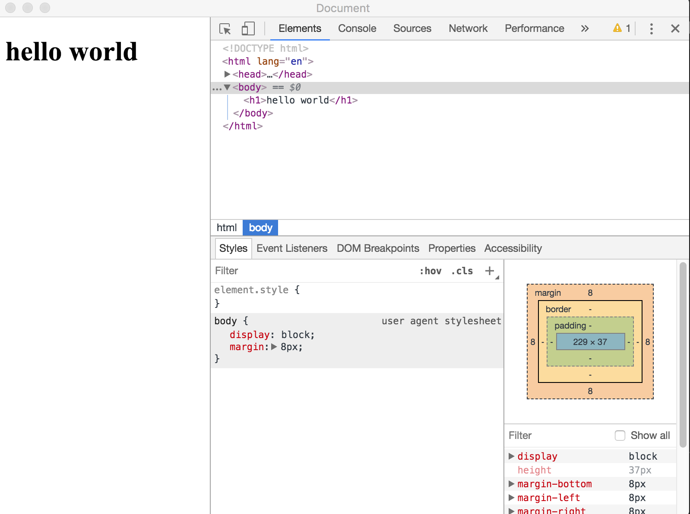

# electron入门教程  

### 1、首先安装node 下载地址：https://nodejs.org/zh-cn/  
### 2、新建 demo01 文件夹  
### 3、终端进入文件夹并初始化项目  
```
cd demo01
npm init
    一路回车
项目文加下会多出package.json文件
```
### 4、修改package.json  
"main":"index.js"--->"main": "main.js"  
```
{
  "name": "demo01",
  "version": "1.0.0",
  "description": "",
  "main": "main.js",
  "scripts": {
    "test": "echo \"Error: no test specified\" && exit 1"
  },
  "author": "",
  "license": "ISC"
}
```
### 5、下载electron  
```
npm install electron --save
```
package.json
```
{
  "name": "demo01",
  "version": "1.0.0",
  "description": "",
  "main": "index.js",
  "scripts": {
    "test": "echo \"Error: no test specified\" && exit 1"
  },
  "author": "",
  "license": "ISC",
  "dependencies": {
    "electron": "^3.0.11"
  }
}
```
项目目录下多了node_modules文件夹  
### 6、在项目目录下新建main.js  
```
// main.js
const { app, BrowserWindow } = require('electron')

// 保持对window对象的全局引用，如果不这么做的话，当JavaScript对象被
// 垃圾回收的时候，window对象将会自动的关闭
let win

function createWindow () {
  // 创建浏览器窗口。
  win = new BrowserWindow({ width: 800, height: 600 })

  // 然后加载应用的 index.html。
  win.loadFile('index.html')

  // 打开开发者工具
  win.webContents.openDevTools()

  // 当 window 被关闭，这个事件会被触发。
  win.on('closed', () => {
    // 取消引用 window 对象，如果你的应用支持多窗口的话，
    // 通常会把多个 window 对象存放在一个数组里面，
    // 与此同时，你应该删除相应的元素。
    win = null
  })
}

// Electron 会在初始化后并准备
// 创建浏览器窗口时，调用这个函数。
// 部分 API 在 ready 事件触发后才能使用。
app.on('ready', createWindow)

// 当全部窗口关闭时退出。
app.on('window-all-closed', () => {
  // 在 macOS 上，除非用户用 Cmd + Q 确定地退出，
  // 否则绝大部分应用及其菜单栏会保持激活。
  if (process.platform !== 'darwin') {
    app.quit()
  }
})

app.on('activate', () => {
  // 在macOS上，当单击dock图标并且没有其他窗口打开时，
  // 通常在应用程序中重新创建一个窗口。
  if (win === null) {
    createWindow()
  }
})

// 在这个文件中，你可以续写应用剩下主进程代码。
// 也可以拆分成几个文件，然后用 require 导入。
```

### 7、在项目目录下新建index.html
```
<!DOCTYPE html>
<html lang="en">
<head>
    <title>Document</title>
</head>
<body>
    <h1>hello world</h1>
</body>
</html>
```  
### 8、修改package.json
修改script
```
{
  "name": "demo",
  "version": "1.0.0",
  "description": "",
  "main": "index.js",
  "scripts": {
    "start": "electron ."
  },
  "author": "",
  "license": "ISC",
  "dependencies": {
    "electron": "^3.0.11"
  }
}
```
### 9、在项目根目录下执行
```
npm run start
```
如果出现下图说明成功
