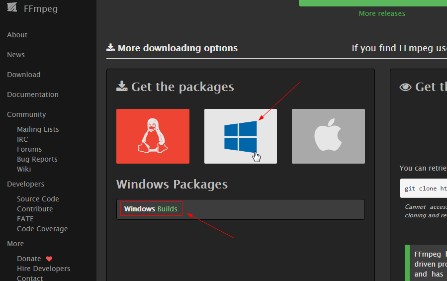
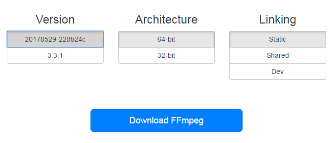
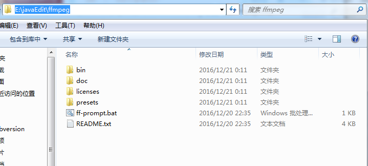
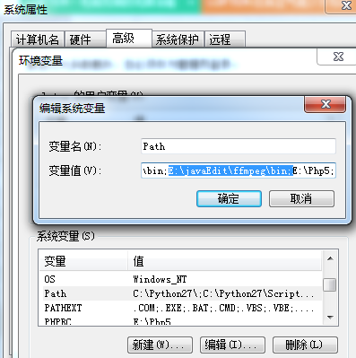
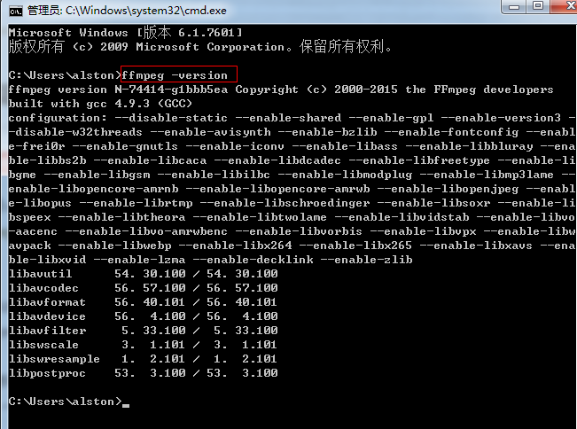

# windows安装ffmpeg
1、进入FFmpeg官网 http://ffmpeg.org/  
找到download页面

2、鼠标放在window的图片上

点击Windows Builds进入到下载页面 

3、在下载页面上，我们可以看到，对于32位和64位版本，分别提供了三种不同的模式：static、shared和dev

static: 该版本提供了静态版本的FFmpeg工具，将依赖的库生成在了最终的可执行文件中；作为工具而言此版本就可以满足我们的需求；  
share: 该版本的工具包括可执行文件和dll，程序运行过程必须依赖于提供的dll文件；  
dev: 提供了库的头文件和dll的引导库；  
4、安装ffmpeg  
4.1 这里下载的是static版本，将其下载解压到E:\javaEdit\ffmpeg目录下：  

4.2配置环境变量：E:\javaEdit\ffmpeg\bin;  

4.3 dos窗口输入 ffmpeg -version  命令，如有信息则说明成功：  
