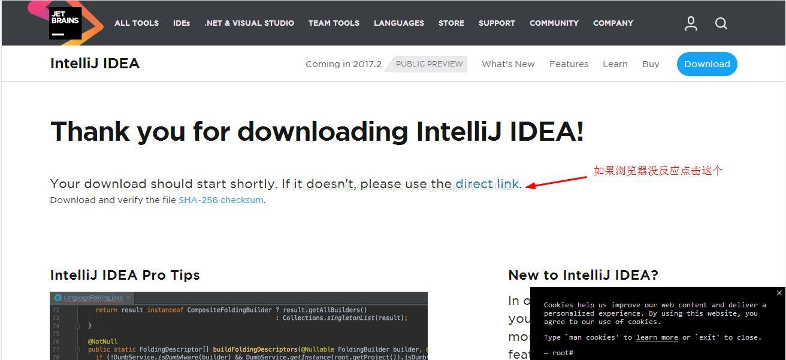
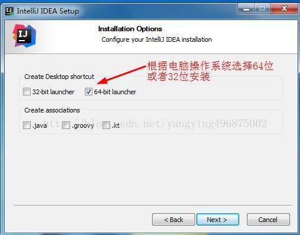

# IntelliJ IDEA（2017）安装和破解
https://www.cnblogs.com/jpfss/p/8872358.html

IDEA 全称 IntelliJ IDEA，是Java语言开发的集成环境，IntelliJ在业界被公认为最好的java开发工具之一，尤其在智能代码助手、代码自动提示、重构、J2EE支持、各类版本工具(Git、svn、github等)、JUnit、CVS整合、代码分析、 创新的GUI设计等方面的功能可以说是超常的。IDEA是JetBrains公司的产品，这家公司总部位于捷克共和国的首都布拉格，开发人员以严谨著称的东欧程序员为主。它的旗舰版本还支持HTML，CSS，PHP，MySQL，Python等。免费版只支持Java等少数语言。这里我们安装旗舰版

1.进入官网下载IntelliJ IDEA https://www.jetbrains.com/idea/download/#section=windows,选择收费版,下面再破解
     
2.点击下载进入下载页开始下载,如果没有弹出下载框,请点击图中位置     
  
3.下载之后双击,开始安装,点击next  
  
4.选择安装路径,最好不要安装到C盘,这里我安装到D盘IDEA文件夹,点击next  
  
5.选择安装32位或者64位的,根据你电脑选择,点击next  
   
6.这里默认就行了,点击install  
  
7.开始安装  
    
8.安装完成,勾选启动  
  
9.点击OK  
  
10.点击接受  
  
11.这里是为收费版idea注册,注册成功,点击激活Activate  
  
可以看到一共3中激活方式  
第一种:购买正版用户(如果有资金最好选择正版)  
第二种:激活码(这种方法在下面有讲解)  
第三种:在线激活(有一个过期时间，这个时间一过就必须再次联网授权服务器请求激活)  
我选择第三中,这种方法时License server的方式来激活的,一定要联网,我选择的是这个网址http://idea.imsxm.com/,目前可以使用  

复制填入下面的某一个license server到License server address输入框中:  

　　http://intellij.mandroid.cn/  
　　http://idea.imsxm.com/  
　　http://idea.iteblog.com/key.php  

注意:如果第三种方式不成功,还想要免费使用,请使用第二种  

方式如下:(在这里我们需要退出激活,等下面步骤完成后,再重启Idea)  

1.下载破解补丁JetbrainsCrack-2.6.2.jar 地址:http://download.csdn.net/detail/gnail_oug/9824630 

或者 http://idea.lanyus.com/  

2.将你下载好的JetbrainsCrack-2.6.2.jar拷贝到你的Idea安装目录的bin目录下,如下图红色框所示  
  
3.在安装的idea下面的bin目录下面有2个文件 ： 一个是idea64.exe.vmoptions，还有一个是idea.exe.vmoptions（如上图绿框）。  

用记事本打开 分别在最下面一行增加一行：-javaagent:D:\IDEA\bin\JetbrainsCrack-2.6.2.jar    

注意:“D:\IDEA\bin\JetbrainsCrack-2.6.2.jar”是我对应的JetbrainsCrack-2.6.2.jar的位置,你用你自己的安装路径。  

4.重新启动软件,再到Acrivation code中选择界面的时候,写入下面注册代码(到2099年到期)  
```
ThisCrackLicenseId-{    
"licenseId":"ThisCrackLicenseId",    
"licenseeName":"idea",    
"assigneeName":"",    
"assigneeEmail":"idea@163.com",    
"licenseRestriction":"For This Crack, Only Test! Please support genuine!!!",    
"checkConcurrentUse":false,    
"products":[    
{"code":"II","paidUpTo":"2099-12-31"},    
{"code":"DM","paidUpTo":"2099-12-31"},    
{"code":"AC","paidUpTo":"2099-12-31"},    
{"code":"RS0","paidUpTo":"2099-12-31"},    
{"code":"WS","paidUpTo":"2099-12-31"},    
{"code":"DPN","paidUpTo":"2099-12-31"},    
{"code":"RC","paidUpTo":"2099-12-31"},    
{"code":"PS","paidUpTo":"2099-12-31"},    
{"code":"DC","paidUpTo":"2099-12-31"},    
{"code":"RM","paidUpTo":"2099-12-31"},    
{"code":"CL","paidUpTo":"2099-12-31"},    
{"code":"PC","paidUpTo":"2099-12-31"}    
],    
"hash":"2911276/0",    
"gracePeriodDays":7,    
"autoProlongated":false}   
```

  
5.能够进入应用界面,说明破解成功(如果还不成功去http://idea.lanyus.com/这个网站看一下)  

12.注册完成之后这个页面,选择主题之后,点击下一步  
  
13.这个界面是配置idea支持的功能  
我们可以自行选择,因为如果使用它默认的有很多没用的插件,我们都用不着,会让你的idea特别卡,所以我们最好是按照自己的需求定制功能插件,首先我们点击Java Frameworks下面的Customize来配置Java相关的  
  
14.点击Customize进入  
  
15.选择自己需要的,点击保存返回,继续选择其他的,都是以同样的方式点击Customize来配置    
  
16.这里选择构建工具    
  
17.配置web开放相关  
  
18.配置版本控制  
  
19.选择测试工具  
  
20.选择服务器  
  
21.选择云相关的  
  
22.如果想直接禁言某一个模块的所以功能插件,可以直接点击Disable All  
  
23.选择UML  
  
24.配置好之后点击next  
这里配置的功能,以后也可以修改,所以不用担心  
  
25.安装插件,以后再安装,点击开始使用  
  
26.启动界面,很炫  
  
27.这个界面就可以配置  
  
28.点击Configure下面的Setting  
  
29.这里是设置界面  
根据自己需求配置,现在不配置也行,以后也可以再配置,这里我们不配置,点击下面的Cancel返回  
  
30.点击Configure下面的Plugins可以进入这个界面  
这里就是前面配置的功能插件,在这里也可以配置,以后也可以配置,点击Cancel返回  
  
31.所有配置完成后,这里点击创建新项目  
  
32.选择Java项目就可以了  
注意:java Enterprise是JavaEE项目,我们先不管,先创建一个Java的简单项目,右边还要配置JDK,选择你JDK的安装目录  
  
33.点击next  
  
34.填上项目名和项目保存地址,点击完成  
  
35.点击OK  
  
35.双击hello这个项目就可以将项目展开  
  
36.在src下创建package  
  
37.在新建的package下面创建一个class  
  
38.这里你可以选择创建类,接口或者其他  
  
39.写上代码,右键运行  
  
第一次运行比较慢,看到控制台打印,好了,你的idea安装完成,开始你的编程之旅吧!!!  