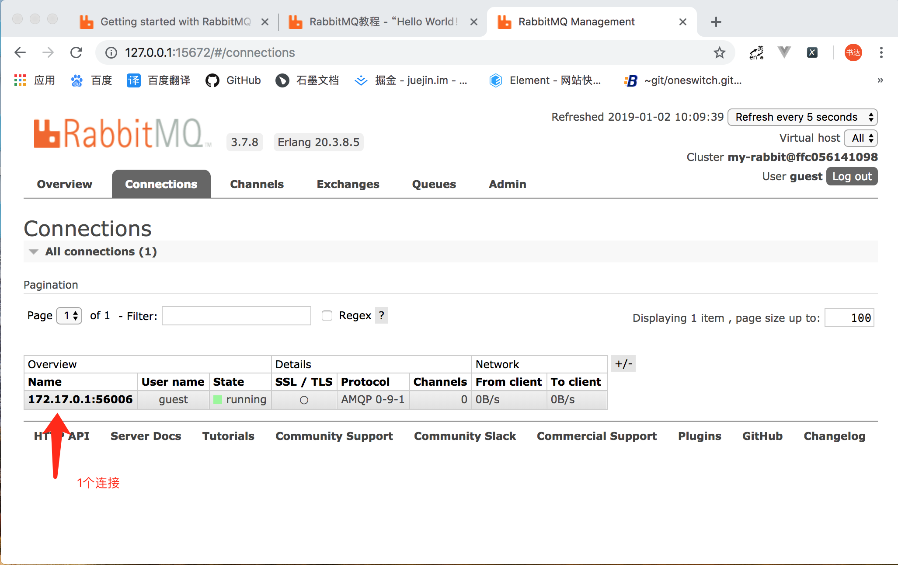
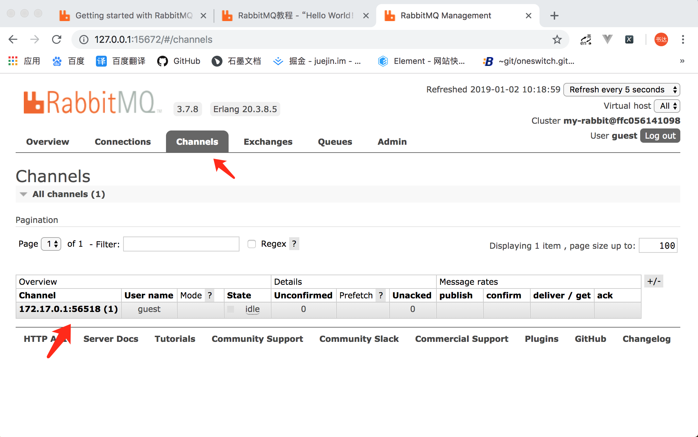
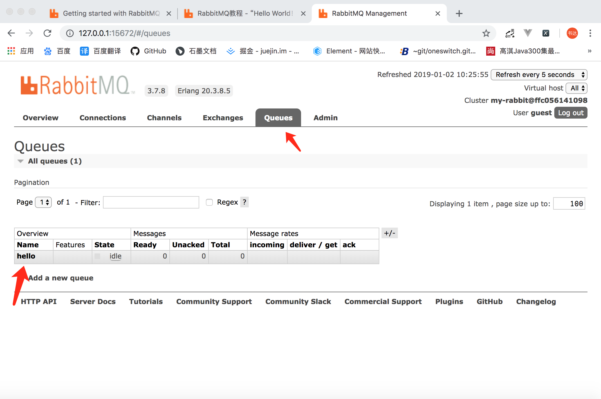
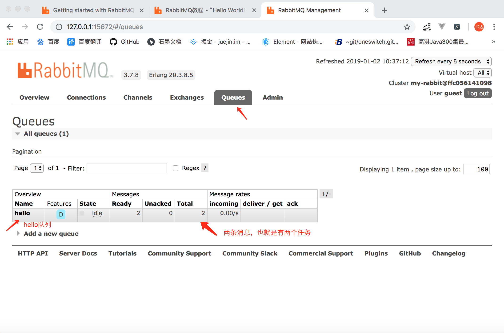

首先我们先来编写生产者  send.js  
1、引入amqp库
```
var amqp = require('amqplib')
```
2、连接服务器  
amqp.connect()
```
var amqp = require('amqplib');

(async function () {
    try {
        //连接rabbitmq服务器
        let conn = await amqp.connect('amqp://localhost');
    } catch (error) {
        console.log(error.message, 'error')
    }
})()
```
此时执行node send.js然后打开浏览器http://127.0.0.1:15672  
可以看到有一个用户连接上了
   
3、创建通道  
conn.createChannel()  
```
var amqp = require('amqplib');

(async function () {
    try {

        //连接rabbitmq服务器
        let conn = await amqp.connect('amqp://localhost');

        //创建一个通道
        let ch = await conn.createChannel();

    } catch (error) {
        console.log(error.message, 'error')
    }

})()
```
此时执行node send.js然后打开浏览器http://127.0.0.1:15672  
可以看到已经有一个通道了  
   
要发送消息必须声明一个队列供我们发送，然后我们可以向队列发布消息  
4、创建队列  
conn.assertQueue()
```
var amqp = require('amqplib');

(async function () {
    try {

        //连接rabbitmq服务器
        let conn = await amqp.connect('amqp://localhost');

        //创建一个通道
        let ch = await conn.createChannel();

        //要发送消息必须声明一个队列供我们发送，然后我们可以向队列发布消息
        //hello:队列名hello
        //durable:true  rabbitmq重启消息队列不会消失，确保不会丢失我们的队列声明它是持久的
        ch.assertQueue('hello', { durable: false })

    } catch (error) {
        console.log(error.message, 'error')
    }

})()
```
此时执行node send.js然后打开浏览器http://127.0.0.1:15672  
可以看到已经有一个队列名为hello的队列  
  
如果durable设置的为false当我们重启rabbitmq后此队列就会消失，包括里面的消息如果为true即使重新启动了rabbitmq此队列依然存在  
ch.assertQueue('hello', { durable: false })  
队列创建好了接下来我们就可以在队列中添加消息了  
5、添加消息   
ch.sendToQueue()
```
var amqp = require('amqplib');

(async function () {
    try {

        //连接rabbitmq服务器
        let conn = await amqp.connect('amqp://localhost');

        //创建一个通道
        let ch = await conn.createChannel();

        //要发送消息必须声明一个队列供我们发送，然后我们可以向队列发布消息
        //hello:队列名hello
        //durable:true  rabbitmq重启消息队列不会消失，确保不会丢失我们的队列声明它是持久的
        ch.assertQueue('hello', { durable: false })

        //往hello队列中添加消息hello world
        ch.sendToQueue('hello', new Buffer('hello world'));
    } catch (error) {
        console.log(error.message, 'error')
    }

})()
```
此时执行node send.js然后打开浏览器http://127.0.0.1:15672  
可以看到在hello队列中有一条消息，每执行一次node send.js消息数就会增加一条  
    
到这里发送消息到队列中就结束了，但是这时候我们发送完消息后进程一直是连接状态的，我们把进程关闭  
6、我们关闭连接并退出  
```
var amqp = require('amqplib');

(async function () {
    try {

        //连接rabbitmq服务器
        let conn = await amqp.connect('amqp://localhost');

        //创建一个通道
        let ch = await conn.createChannel();

        //要发送消息必须声明一个队列供我们发送，然后我们可以向队列发布消息
        //hello:队列名hello
        //durable:true  rabbitmq重启消息队列不会消失，确保不会丢失我们的队列声明它是持久的
        ch.assertQueue('hello', { durable: false })

        //往hello队列中添加消息hello world
        ch.sendToQueue('hello', new Buffer('hello world'));

        console.log('[x] 发送消息成功: hello world');

        //关闭连接并退出 如果不用setTimeout消息添加不到队列中
        setTimeout(function () {
            conn.close();
            process.exit(0);
        }, 500)
        
    } catch (error) {
        console.log(error.message, 'error')
    }

})()
```

接下来我们编写消费者 receive.js  

1、引入amqplib库
```
var amqp = require('amqplib');
```
2、连接到服务器
```
var amqp = require('amqplib');

(async function () {
    //连接服务器
    let conn = await amqp.connect('amqp://localhost');
})()
```
3、创建通道
```
var amqp = require('amqplib');

(async function () {
    //连接服务器
    let conn = await amqp.connect('amqp://localhost');

    //创建通道
    let ch = await conn.createChannel();
})()
```

4、声明hello队列，此处不是必须的，如果不声明一定要确保hello队列存在

```
var amqp = require('amqplib');

(async function () {
    //连接服务器
    let conn = await amqp.connect('amqp://localhost');

    //创建通道
    let ch = await conn.createChannel();

    //声明hello队列
    ch.assertQueue('hello', { durable: false });
})()
```

5、消费hello队列中的消息
```
var amqp = require('amqplib');

(async function () {
    //连接服务器
    let conn = await amqp.connect('amqp://localhost');

    //创建通道
    let ch = await conn.createChannel();

    //声明hello队列
    ch.assertQueue('hello', { durable: false });

    //消费hello队列中的消息
    ch.consume('hello', function (msg) {
        console.log('[x]接收到消息：' + msg.content.toString())
    }, { noAck: true }) //是否需要确认消息消费

})()

```