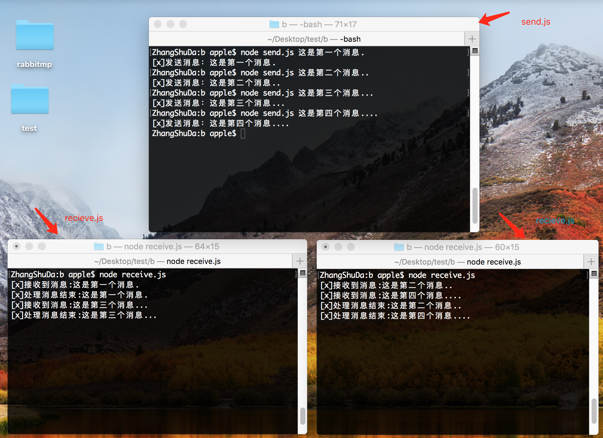

# 一个消息只分配给一个消费者   
一个消息队列有两个消费者的情况，是两个消费者平均分配任务   

记得先删除队列，因为durable是不能修改的  

首先我们先来编辑发布消息 send.js    
这里我们接收传参的形式   
```
//node send.js 这是第一条消息...
var amqp = require('amqplib');

(async function () {
    try {
        let msg = process.argv[2]; // 这是第一条消息...
        //连接服务器
        let conn = await amqp.connect('amqp://localhost');

        //创建一个通道
        let ch = await conn.createChannel();

        //声明hello队列
        ch.assertQueue('hello', { durable: false });

        //往hello队列中添加消息
        ch.sendToQueue('hello', new Buffer(msg))

        console.log('[x]发送消息：' + msg)

        //关闭连接
        setTimeout(function () {
            conn.close();
            process.exit(0);
        }, 500)

    } catch (error) {
        console.log(error.message);
    }
})()
```

接下来我们看下receive.js  
我们假定处理程序的时间根据消息后面的点决定 一个点为10s  

```
var amqp = require('amqplib');

(async function () {
    //创建连接
    let conn = await amqp.connect('amqp://localhost');

    //创建一个通道
    let ch = await conn.createChannel()

    //声明一个消息队列
    ch.assertQueue('hello', { durable: false });

    //消费hello队列中的消息
    ch.consume('hello', function (msg) {
        let secs = msg.content.toString().split('.').length - 1;
        console.log('[x]接收到消息:' + msg.content.toString())
        //假定处理消息时间长短根据消息后面点决定，一个点为10s

        setTimeout(function () {
            console.log('[x]处理消息结束:' + msg.content.toString())
        }, secs * 10000)

    }, { noAck: true })
})()
```

我们先启动两个receive.js

```
node  receive.js
node  receive.js
```

接下来我们发送消息看看消息是怎么派发任务的，
```
node send.js 这是第一个消息.
node send.js 这是第二个消息..
node send.js 这是第三个消息...
node send.js 这是第四个消息....
```

此时我们看到两个消费者平均分配任务，无论是否正在处理消息  


默认情况下，RabbitMQ将按顺序将每条消息发送给下一个消费者。平均而言，每个消费者将获得相同数量的消息。这种分发消息的方式称为循环法。  


### 消息确认  
消费者开始执行任务此时消息就会标记为删除，这时连接断开，消息会丢失，为了确保消息不会丢失，我们使用rabbitmq的消息确认以告知rabbitmq可以删除它了  
> noAck设置为false, 默认为false。  
ch.ack(msg);  

receive.js
```
var amqp = require('amqplib');

(async function () {
    //创建连接
    let conn = await amqp.connect('amqp://localhost');

    //创建一个通道
    let ch = await conn.createChannel()

    //声明一个消息队列
    ch.assertQueue('hello', { durable: false });

    //消费hello队列中的消息
    ch.consume('hello', function (msg) {
        let secs = msg.content.toString().split('.').length - 1;
        console.log('[x]接收到消息:' + msg.content.toString())
        //假定处理消息时间长短根据消息后面点决定，一个点为10s

        setTimeout(function () {
            console.log('[x]处理消息结束:' + msg.content.toString())
            //消息确认
            ch.ack(msg);
        }, secs * 10000)

    }, { noAck: false })
})()
```
send.js
```
//node send.js 这是第一条消息...
var amqp = require('amqplib');

(async function () {
    try {
        let msg = process.argv[2]; // 这是第一条消息...
        //连接服务器
        let conn = await amqp.connect('amqp://localhost');

        //创建一个通道
        let ch = await conn.createChannel();

        //声明hello队列
        ch.assertQueue('hello', { durable: false });

        //往hello队列中添加消息
        ch.sendToQueue('hello', new Buffer(msg))

        console.log('[x]发送消息：' + msg)

        //关闭连接
        setTimeout(function () {
            conn.close();
            process.exit(0);
        }, 500)

    } catch (error) {
        console.log(error.message);
    }
})()
```
### 消息持久性  
上面已经解决了即使消费者死亡页不会丢失消息，如果rabbitmq服务器停止我们的消息依然会丢失，
当RabbitMQ退出或崩溃时，它将忘记队列和消息，除非你告诉它不要。确保消息不会丢失需要做两件事：我们需要将队列和消息都标记为持久。

首先我们要声明一个持久的队列，以确保rabbitmq永远不会丢失我们的队列  
```
ch.assertQueue('hello', {durable: true});  
ch.sendToQueue('hello', new Buffer('hello world'), {persistent: true})
```
receive.js
```
var amqp = require('amqplib');

(async function () {
    //创建连接
    let conn = await amqp.connect('amqp://localhost');

    //创建一个通道
    let ch = await conn.createChannel()

    //声明一个消息队列
    //durable: true rabbitmq服务器停止页不会删除队列
    ch.assertQueue('hello', { durable: true });

    //消费hello队列中的消息
    ch.consume('hello', function (msg) {
        let secs = msg.content.toString().split('.').length - 1;
        console.log('[x]接收到消息:' + msg.content.toString())
        //假定处理消息时间长短根据消息后面点决定，一个点为10s

        setTimeout(function () {
            console.log('[x]处理消息结束:' + msg.content.toString())
            //消息确认
            //确认后才会删除此消息
            ch.ack(msg);
        }, secs * 10000)

    }, { noAck: false })
})()
```
send.js
```
//node send.js 这是第一条消息...
var amqp = require('amqplib');

(async function () {
    try {
        let msg = process.argv[2]; // 这是第一条消息...
        //连接服务器
        let conn = await amqp.connect('amqp://localhost');

        //创建一个通道
        let ch = await conn.createChannel();

        //声明hello队列
        //durable: true rabbitmq服务器停止页不会删除队列
        ch.assertQueue('hello', { durable: true });

        //往hello队列中添加消息
        //persistent: true 将消息标记为持久性
        ch.sendToQueue('hello', new Buffer(msg), { persistent: true })

        console.log('[x]发送消息：' + msg)

        //关闭连接
        setTimeout(function () {
            conn.close();
            process.exit(0);
        }, 500)

    } catch (error) {
        console.log(error.message);
    }
})()
```

### 公平派遣   
前面我们已经测试了任务是平均分配的，现在我们需要空闲的接收任务而不再是平均分配
>ch.prefetch(1)  

receive.js
```
var amqp = require('amqplib');

(async function () {
    //创建连接
    let conn = await amqp.connect('amqp://localhost');

    //创建一个通道
    let ch = await conn.createChannel()

    //声明一个消息队列
    //durable: true rabbitmq服务器停止页不会删除队列
    ch.assertQueue('hello', { durable: true });

    //公平派遣
    ch.prefetch(1);
    
    //消费hello队列中的消息
    ch.consume('hello', function (msg) {
        let secs = msg.content.toString().split('.').length - 1;
        console.log('[x]接收到消息:' + msg.content.toString())
        //假定处理消息时间长短根据消息后面点决定，一个点为10s

        setTimeout(function () {
            console.log('[x]处理消息结束:' + msg.content.toString())
            //消息确认
            //确认后才会删除此消息
            ch.ack(msg);
        }, secs * 10000)

    }, { noAck: false })
})()
```

send.js
```
//node send.js 这是第一条消息...
var amqp = require('amqplib');

(async function () {
    try {
        let msg = process.argv[2]; // 这是第一条消息...
        //连接服务器
        let conn = await amqp.connect('amqp://localhost');

        //创建一个通道
        let ch = await conn.createChannel();

        //声明hello队列
        //durable: true rabbitmq服务器停止页不会删除队列
        ch.assertQueue('hello', { durable: true });

        //往hello队列中添加消息
        //persistent: true 将消息标记为持久性
        ch.sendToQueue('hello', new Buffer(msg), { persistent: true })

        console.log('[x]发送消息：' + msg)

        //关闭连接
        setTimeout(function () {
            conn.close();
            process.exit(0);
        }, 500)

    } catch (error) {
        console.log(error.message);
    }
})()
```