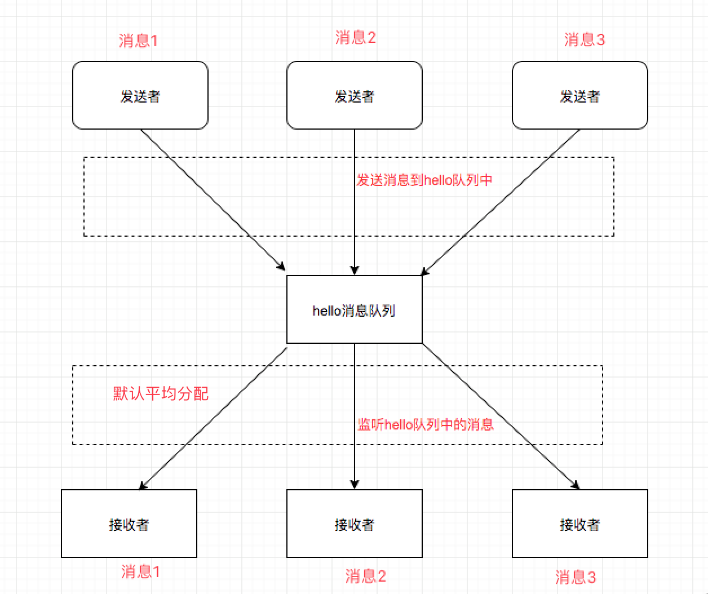
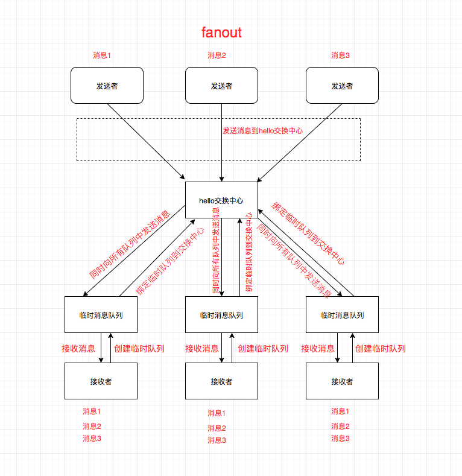
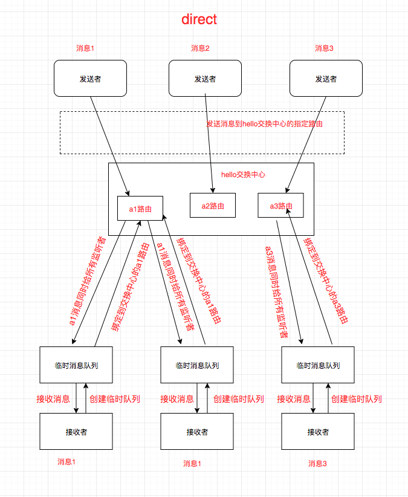
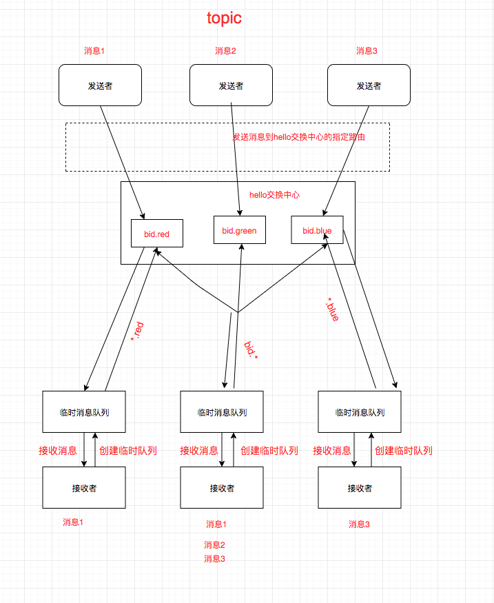

参考[rabbitmq教程](http://www.rabbitmq.com/getstarted.html)  

rabbitmq是一个消息中间件，教程中把他比作为邮局，这个比喻很恰当。

在rabbitmq中需要了解  
```
生产者：生产者也就是发送者，产生消息的一方，将消息放入队列中
消费者：消费者也就是接受者，rabbitmq把该队列中的消息派发给消费者
队列：
通道：
```

我们项目中的应用场景  
我们把微信相关的放到了微信的微服务上，微信发送消息，通过rabbitmq发送，用的是topic模式区分不同的环境。   

### 1、普通模式     
生产者将消息发送到固定的消息队列(hello 队列)，消费者消费固定的队列的消息

一个消息只分配给一个消费者  
队列名称唯一固定。
普通模式、适用于处理用时长的处理程序，可以设置多个消费者来处理同一个队列中的消息  



### 2、发布订阅者模式 fanout  
生产者将消息发送到固定的交换中心（hello交换中心）,
消费者生成临时队列然后绑定到交换中心

一个生产者，多个消费者同时处理一个消息  
例如：日志，来自一个主机，根据消息，消费者1写入文件，消费者2显示在终端    
  

### 3、路由模式   direct  

生产者将消息发送到固定的交换中心（hello交换中心）的a1路由上
消费者生成临时队列然后绑定到交换中心的指定路由上  
 

###4、topic模式  topic  

生产者将消息发送到固定的交换中心（hello交换中心）的a1路由上
消费者生成临时队列然后绑定到交换中心的一类路由上    
 

### 5、rpc模式  
生产者创建临时队列，
生产者将消息发送到hello队列中，并且带上临时队列的id和随机数
生产者监听临时队列，如果消息的随机数与生成的随机数是否相同

消费者监听hello队列
取出消息属性中保存的临时队列id和随机数
发送消息到属性中保存的临时队列中，并带上随机数
